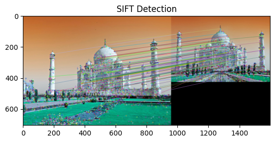
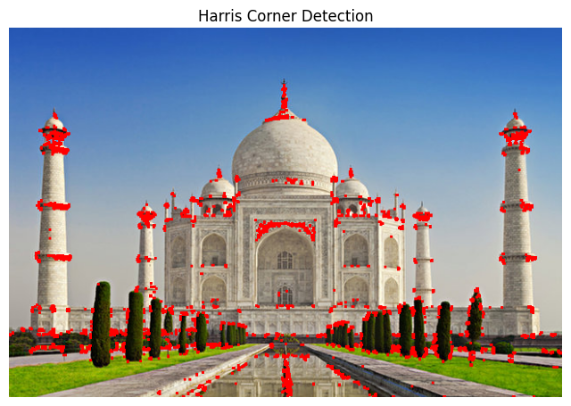
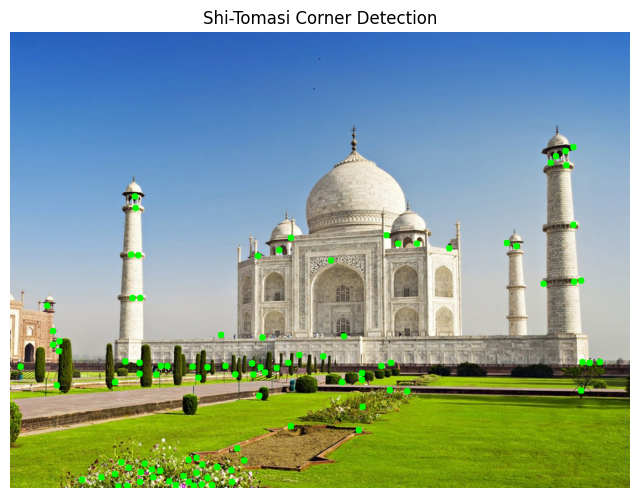
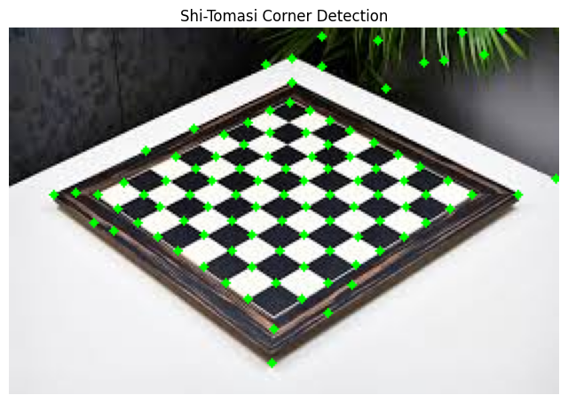

# 🧠 Mini Project: Feature Detection using OpenCV

### 👩‍🎓 Name: Sanvika Dakhale  
### 🧾 Batch: B1  
### 🔢 Roll No: 18

This mini project showcases the implementation of three foundational computer vision algorithms using Python and OpenCV:

- **SIFT Feature Detection and Matching**
- **Harris Corner Detection**
- **Shi-Tomasi Corner Detection**

These techniques are used to detect key features and corner points in images, which are essential in many computer vision applications like object recognition, image stitching, and tracking.

---

## 🔍 1. SIFT Feature Detection and Matching

This section implements the **SIFT (Scale-Invariant Feature Transform)** algorithm to detect and match keypoints between two input images.

### 🧪 Steps:
- Load two images: a train image (reference) and a query image (scene)
- Convert both to grayscale
- Detect keypoints and compute descriptors using `cv2.SIFT_create()`
- Use **Brute-Force Matching** with L2 norm
- Sort matches by distance and visualize top 50 matches
- Draw the matches using `cv2.drawMatches()`

> ✅ SIFT is scale-, rotation-, and illumination-invariant, making it powerful for object recognition tasks.

### 🖼️ Example Output:



---

## 🏁 2. Harris Corner Detection

This task uses the **Harris Corner Detector** to find and highlight corners in a grayscale image.

### 🧪 Steps:
- Convert the input image to grayscale
- Use `cv2.cornerHarris()` to compute corner responses
- Enhance and threshold responses to find strong corners
- Mark corners on the original image in red

> ✅ Harris detects sharp intensity changes in multiple directions – a good indicator of corners.

### 🖼️ Example Output:




---

## 🌿 3. Shi-Tomasi Corner Detection

This section implements the **Shi-Tomasi** algorithm, an improvement over Harris for detecting reliable corners.

### 🧪 Steps:
- Load and convert the image to grayscale
- Use `cv2.goodFeaturesToTrack()` to detect corner points
- Draw circles on detected corners using OpenCV
- Display the result with Matplotlib

> ✅ Shi-Tomasi selects the most stable corners using quality scores.

### 🖼️ Example Output:




---

## 🛠️ Tech Stack

- **Python 3.x**
- **OpenCV (cv2)**
- **NumPy**
- **Matplotlib**
- **Jupyter Notebook / Google Colab**

---

## 🚀 How to Run

1. Install dependencies:

```bash
pip install opencv-contrib-python numpy matplotlib
